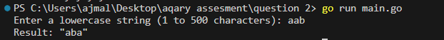
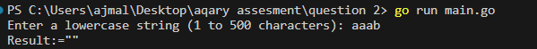
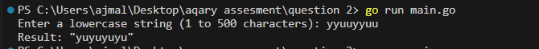
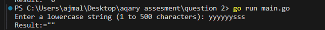

# aqary-question-2
Assesment question number 2 given by aqary international group

//here numbers can also added as a string

Question # 2

Given a string s, rearrange the characters of s so that any two adjacent characters are not the same.
Return any possible rearrangement of s or return "" if not possible.

Example 1:

Input: s = "aab"
Output: "aba"

Example 2:

Input: s = "aaab"
Output: ""

Constraints:

1 <= s.length <= 500
s consists of lowercase English letters.

Output:=

1:= Input: s = "aab"

2:= Input: s = "aaab"

3:= Input: s = "yyuuyyuu"

4:= Input: s = "yyyyyysss"

